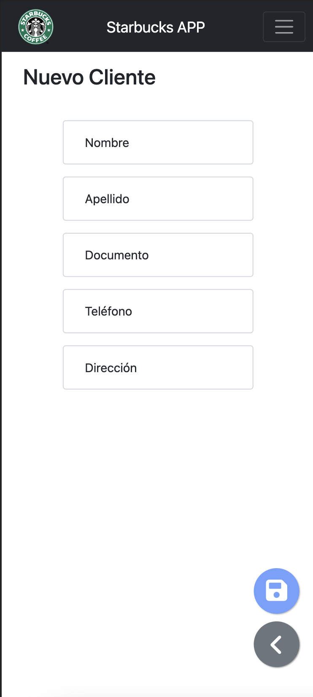

# starbucks-sample-go

App desarrollada en Golang utilizando el framework Gin gonic, que ofrece de forma embebida una librería para renderizar páginas html.

App de ejercicio para la materia Sistemas Colaborativos de la Universidad Siglo 21

## App Screenshots

